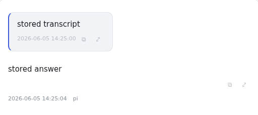
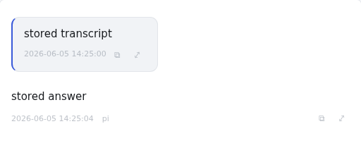

# Manual testing

## What this document is

**The evidence behind the live runs**, and the instructions for reproducing
them. It does not state project status — `WORKSTREAMS.md`'s Status table does
that, and `docs/work/open/` holds what is still outstanding. Record a run's
results here; record what the run left undone as a new work item there.

Two substantial live-backend runs are recorded below, both on 2026-08-11
(America/New_York): Codex with `codex-cli 0.147.0`, and Pi with `pi 0.84.1`,
each through the production composition. Later sections record narrower
measurements made after that: preview/listing timing, the browser-only OW-47
follow-mode reproduction, and the dispatched-worktree base probe.

Those two backend-backed runs drove the application's REST and SSE interfaces
from a deterministic local harness, against a real agent subprocess, after
fetching the production-built client from the Bun server. Neither of those two
runs was **browser automation**: they make no mouse, keyboard, or DOM
assertions. The browser-automation evidence now in this file is the later OW-47
section, and it is intentionally narrow — a synthetic backend in `e2e/`, not
the backend-backed E2E coverage OW-24 still tracks.

## Reproducible Codex setup

The durable smoke harness asserts every criterion, exits nonzero on failure,
captures its run-scoped PIDs automatically, and cleans up temporary state:

```bash
cd "$(git rev-parse --show-toplevel)"
python3 resources/probes/agentpane_codex_smoke.py \
  --workspace /home/asa0717/src/agentpane
```

It copies credential files by name without printing their contents and leaves
the real `~/.codex` untouched. Do not enable shell tracing while running it.
Run `python3 resources/probes/agentpane_codex_smoke.py --help` for checkout,
workspace, port, credential-source, and build options.

The equivalent manual setup is below for interactive inspection:

```bash
APP_ROOT="$(git rev-parse --show-toplevel)"
WORKSPACE=/home/asa0717/src/agentpane
SMOKE_PORT=44173
CODEX_SMOKE_HOME="$(mktemp -d /var/tmp/agentpane-live-codexhome-XXXXXX)"
SERVER_LOG="$(mktemp /var/tmp/agentpane-live-server-XXXXXX.log)"

for name in auth.json config.toml; do
  if test -f "$HOME/.codex/$name"; then
    install -m 600 "$HOME/.codex/$name" "$CODEX_SMOKE_HOME/$name"
  fi
done

cd "$APP_ROOT"
codex --version
bun run build
CODEX_HOME="$CODEX_SMOKE_HOME" PORT="$SMOKE_PORT" \
  bun run start >"$SERVER_LOG" 2>&1 &
SERVER_PID=$!
```

Once the server reports that it is listening, confirm the built SPA is being
served as a browser navigation:

```bash
curl --fail --silent --show-error \
  -H 'Accept: text/html' \
  "http://127.0.0.1:$SMOKE_PORT/" \
  | grep '<div id="app"></div>'
```

Open one SSE stream before creating a session and retain it across the turn:

```bash
SSE_LOG="$(mktemp /var/tmp/agentpane-live-sse-XXXXXX.log)"
curl --no-buffer --silent --show-error \
  "http://127.0.0.1:$SMOKE_PORT/api/events" >"$SSE_LOG" &
SSE_PID=$!

CREATE_RESPONSE="$(curl --fail --silent --show-error \
  -H 'content-type: application/json' \
  -d "{\"cwd\":\"$WORKSPACE\",\"backend\":\"codex\"}" \
  "http://127.0.0.1:$SMOKE_PORT/api/sessions")"
VIRTUAL_ID="$(jq -r '.ref.id' <<<"$CREATE_RESPONSE")"
ENCODED_VIRTUAL_ID="$(jq -rn --arg value "$VIRTUAL_ID" '$value|@uri')"

ATTACH_RESPONSE="$(curl --fail --silent --show-error \
  "http://127.0.0.1:$SMOKE_PORT/api/sessions/codex/$ENCODED_VIRTUAL_ID")"
CODEX_ID="$(jq -r '.session.ref.id' <<<"$ATTACH_RESPONSE")"
ENCODED_CODEX_ID="$(jq -rn --arg value "$CODEX_ID" '$value|@uri')"
SESSION_URL="http://127.0.0.1:$SMOKE_PORT/api/sessions/codex/$ENCODED_CODEX_ID"
```

Submit a text-only prompt, then inspect the SSE log structurally. Do not assert
on live model wording: look for multiple `upsert` events and a lifecycle
`snapshot` or `status` whose `isStreaming` value returns to `false`.

```bash
curl --fail --silent --show-error \
  -H 'content-type: application/json' \
  -d '{"text":"Do not use tools. Write one sentence of at least 120 words explaining why deterministic tests are useful."}' \
  "$SESSION_URL/prompt"

grep '^data: ' "$SSE_LOG" | sed 's/^data: //' \
  | jq -c 'select(.type == "upsert" or .type == "snapshot" or .type == "status")'
```

To test reconnect, stop only the curl process started above, start a new SSE
request, and verify its opening events include a complete `snapshot`. Compare
the server-scoped process tree before and after; the native `codex app-server`
PID must be unchanged.

```bash
kill "$SSE_PID"
wait "$SSE_PID" 2>/dev/null || true
pstree -ap "$SERVER_PID"

SSE_LOG_2="$(mktemp /var/tmp/agentpane-live-sse-reconnect-XXXXXX.log)"
curl --no-buffer --silent --show-error \
  "http://127.0.0.1:$SMOKE_PORT/api/events" >"$SSE_LOG_2" &
SSE_PID_2=$!
```

For abort, submit work deliberately long enough to remain active, wait for
`isStreaming:true`, then abort and require the following lifecycle state to be
`false`:

```bash
curl --fail --silent --show-error \
  -H 'content-type: application/json' \
  -d '{"text":"Do not use tools. Write the integers from 1 through 10000, one per line, and continue until every integer is written."}' \
  "$SESSION_URL/prompt"

curl --fail --silent --show-error -X POST "$SESSION_URL/abort"
```

Finally, send `SIGTERM` only to the server started for this run, wait for it,
and confirm the native Codex PID previously found beneath it no longer exists.
Use the durable harness above when a machine-checked process assertion is
required: it walks `/proc` recursively from its own server PID and never
inspects or kills unrelated Codex processes.

```bash
kill "$SSE_PID_2"
wait "$SSE_PID_2" 2>/dev/null || true
kill -TERM "$SERVER_PID"
wait "$SERVER_PID"
```

After the server and SSE curl have stopped, remove only this run's temporary
files:

```bash
case "$CODEX_SMOKE_HOME" in
  /var/tmp/agentpane-live-codexhome-*) rm -rf -- "$CODEX_SMOKE_HOME" ;;
esac
rm -f -- "$SERVER_LOG" "$SSE_LOG"
test -z "${SSE_LOG_2:-}" || rm -f -- "$SSE_LOG_2"
```

## Observed Codex results

The accepted run used the checked-in harness against the fixed tree, after the
final review's shutdown-race fix and after the harness's own abort, process
scope, and cleanup criteria were tightened. It began at
`2026-08-11T16:00:55.958-04:00` and ended at `2026-08-11T16:01:14.524-04:00`.

| Check | Observed result |
|---|---|
| 1. Create a Codex session for `/home/asa0717/src/agentpane` | Passed at `16:00:57.957-04:00`. Create returned HTTP 201, attach returned HTTP 200, and the virtual id was replaced by a real Codex thread id. |
| 2. Submit text only and observe incremental transcript updates | Passed. Prompt returned HTTP 202. The assistant message at index 1 produced 18 observed upserts with 18 distinct increasing text lengths; the check returns as soon as growth is established, here at 95 characters, and the completed message reached 971. No model wording was asserted or recorded. |
| 3. Observe streaming return to idle | Passed. `isStreaming:true` arrived at `16:00:57.982-04:00`; an authoritative snapshot carried `isStreaming:false` at `16:01:03.616-04:00`. |
| 4. Refresh/reconnect repaint without a duplicate child | Passed at `16:01:12.479-04:00`. A new SSE connection immediately received a two-message snapshot containing the completed 971-character assistant message. Native Codex PID `5921` was the only worker before and after reconnect. |
| 5. Abort a deliberately long prompt | Passed. The second prompt returned HTTP 202 and streamed at `16:01:12.543-04:00`. The session was still reported streaming at the moment of the request; abort was requested at `16:01:12.932-04:00`, returned HTTP 204, and a snapshot recorded idle at `16:01:12.941-04:00` — after the request, not merely after the prompt. The transcript was 971 characters when idle was reported and unchanged 1.5s later. |
| 6. Stop the server without an orphaned app server | Passed. SIGTERM was sent at `16:01:14.491-04:00`; the server exited 0 at `16:01:14.523-04:00`, after run-scoped native Codex PID `5921` had exited. |

Built-client reachability also passed: `/` returned HTTP 200 with the expected
application mount at `16:00:57.471-04:00`.

Cleanup was verified rather than assumed: no run-scoped worker survived, and
the temporary Codex home and server log were both confirmed removed.

The stable long-lived process chain observed before and after reconnect was:

```text
bun (server) 5888
└─ bwrap 5907
   └─ bwrap 5913
      └─ node codex launcher 5914
         └─ native codex app-server 5921
```

The `Popen` wrapper this run launched was PID `5887`. The native worker also
spawned short-lived `git` and `lsb_release` children of its own during the run;
they are descendants of the server tree and disappeared with it.

Production constructs the spawn as `direnv exec <workspace> sbox -- codex
app-server`. `direnv` and the Python `sbox` wrapper exec into the long-lived
processes above, so they did not remain as separate process-tree entries. The
presence of the bwrap namespace and the injected native argument
`--sandbox danger-full-access app-server` confirmed the production sbox path.

Earlier harness-only observations were corrected before any evidence was
accepted: static navigation requires `Accept: text/html`; lifecycle state may
arrive in a `snapshot` rather than only a `status` event; an abort scanned from
the prompt rather than from the request can be satisfied by an idle the abort
did not cause; and `/proc/<pid>/stat` cannot be split on whitespace to find a
parent pid. None of those required an application source change.

Review did produce application hardening ahead of this run. The prompt route
acknowledges only after backend admission succeeds; selection ignores stale
attach completions and stale create responses; Codex disposal awaits process
close with bounded SIGTERM-to-SIGKILL escalation; an adapter still inside
`start()` is now visible to `close()`/`disposeAll()`, so shutdown can no longer
return having orphaned one; and Pi's first-prompt id probe can no longer fail a
turn the backend has already admitted. Every one of those behaviours is covered
by a regression that was observed failing before its fix.

## Observed Pi results

Run with `python3 resources/probes/agentpane_pi_smoke.py --workspace <dir>`,
on `pi 0.84.1`, 2026-08-11 America/New_York. Three of the four checks that were
deferred as manual are now automated; the fourth is partly closed.

| Check | Observed result |
|---|---|
| 1. `direnv -> sbox/bwrap -> pi` startup | Passed. Create returned HTTP 201 and attach HTTP 200, with exactly one Pi agent under the server. The chain is `bun -> bwrap -> bwrap -> pi`; `direnv` and the Python `sbox` wrapper exec into it rather than surviving beside it, the same shape Codex shows. |
| 2. Virtual-id materialization and the `renamed` event | Passed, but **not where it was expected**: Pi names its session file during `start()`, so the rename lands during attach rather than on the first prompt (HANDOFF finding 41). The adopted id is a real `.jsonl` path, the superseded `virtual:` id still resolves, and it resolves to the new ref. A prompt sent through the superseded id returned HTTP 202. |
| 3. Streaming and tool output | Passed at the transport boundary. 16 upserts with 16 distinct increasing lengths, then idle via an authoritative snapshot. With `--tool-check`, a turn produced `thinking` and `toolCall` blocks with no approval dialog. **Still not verified in a browser against a real backend** — the DOM half of the original check, open as OW-24. |
| 4. Abort and shutdown with no orphan | Passed. The long turn was streaming when abort was requested; abort returned HTTP 204 and idle followed, with the transcript unchanged 1.5s later. SIGTERM to the server exited it 0 with no run-scoped Pi worker remaining. |

Cleanup was verified rather than assumed on every run: no orphaned worker, and
the temporary `PI_CODING_AGENT_DIR` and server log both confirmed removed.

## Observed preview and listing timing (OW-38, OW-23)

Recorded 2026-08-14 against a running production server (`bun run start`,
default port 4173) over a live local corpus of **1001 stored sessions**. These
are REST-only `curl` timings of two read paths that **spawn nothing** — the
on-disk listing and the OW-38 preview route; no agent subprocess was involved.
Not browser automation (OW-24).

Reproduce, with the server already listening:

```bash
curl -s -o /tmp/sessions.json \
  -w '%{time_total}s %{size_download}B\n' \
  http://127.0.0.1:4173/api/sessions
jq '.sessions | length' /tmp/sessions.json
```

| Path | Observed |
|---|---|
| `GET /api/sessions` (1001 sessions) | 0.16–0.24s warm, 429 KB. Matches OW-23's whole-corpus parse (the ~0.28s/973-files figure cited there); real and roughly corpus-linear, but not the cause of any freeze. |
| `GET /…/preview` × the 10 most-recent | 6–14 ms each, size-insensitive: a 36-turn/15 KB Pi transcript previewed in 6.6 ms, a 1-turn/112 B Codex session in 11 ms. |

Two structural findings, both confirming OW-38's design holds at scale:

- The preview reads exactly one file and never walks the corpus — cost is flat
  in transcript size, so a large most-recent session does not make the *fetch*
  slow. Any startup cost from a big transcript is client-side rendering, not the
  route.
- Pi previews (~6 ms) beat Codex (~11–13 ms) consistently: Pi's ref *is* the
  JSONL path (D9, a direct read), while Codex does the `findJsonlFiles`
  readdir walk to match the thread id in the filename.

The perceived "slow session load" reported the same day was **not** either
endpoint: the browser was spinning in OW-39's startup auto-select loop
(`effect_update_depth_exceeded`, OW-41) until Svelte aborted. Neither read path
is implicated.

## Observed follow-mode decay in a real browser (OW-47)

Recorded 2026-08-15 in headless Chromium (Chrome for Testing 151), driven by
the committed harness in `e2e/` — the real `App.svelte` and the real
`controller.ts` against a synthetic `AgentpaneApi`, no backend and no
subprocess. This is the first browser automation in the repo; it is a vehicle
for this one defect and **not** the general E2E coverage OW-24 still tracks.

Reproduce:

```bash
bun run test:browser                       # green
sed -i 's/ overflow-anchor: none;//' src/client/app.css
bun run test:browser                       # red, then: git checkout src/client/app.css
```

| Condition | Observed |
|---|---|
| `.conversation` with `overflow-anchor: none` | All 10 turns of a 40-turn-deep conversation end locked flush at the pane top (≤2px). |
| Same, fix reverted | Fails on the first measured turn: the prompt stops **51px** from the top and stays stranded there. |

The cause is **CSS scroll anchoring**, which none of the item's three candidates
named. The browser repositions `scrollTop` itself to keep a visual anchor
stable as content reflows above the viewport; the agent's instrumented run
measured it under-compensating by ~10px per adjustment. That produces a
`scroll` event the application never performed, and
`handleConversationScroll` correctly cannot tell it from a reader grabbing the
scrollbar — so it clears the anchor and follow disengages mid-turn. Candidate
(a) was the right *shape* (a phantom scroll read as manual) but the wrong
source: not two programmatic scrolls racing one boolean, but the browser
scrolling on its own. A guard against the boolean race was tried and reverted
after it changed no outcome — that race remains real but unproven, now OW-48.

Two findings worth keeping:

- **The transcript has to shrink mid-turn to reproduce this.** `Thinking.svelte`
  holds its `<details>` open only while it is the streaming block, so the moment
  a `toolCall` lands the thinking block collapses and the transcript gets
  shorter. Text-only turns were driven to 200 seeded turns and never
  reproduced it. Any future follow-mode harness needs a turn shape that
  contracts, not just one that grows.
- **jsdom could not have found this**, and still cannot pin it: no layout, no
  scroll anchoring, no real scroll-event timing. `bun run check` does not run
  the browser test (OW-49).

## Observed worktree base for dispatched subagents (OW-58)

Recorded 2026-08-16 from two dispatched worktrees in the same session, each
measured before the agent had edited anything. Not an application test: what is
under test is the harness that cuts the worktree.

Reproduce, first thing in a dispatched worktree:

```bash
git rev-parse HEAD main origin/main origin/HEAD
git rev-list --count HEAD..main
git reflog show "$(git branch --show-current)" | tail -1
```

| Run | Worktree `HEAD` at start | Local `main` | Behind |
|---|---|---|---|
| 1 (landed `9b786a6`) | `9ad0a6d` | `c04f26c` | 19 |
| 2 (this record) | `9ad0a6d` | `cda74e6` | 21 |

`origin/main` and `origin/HEAD` both point at `9ad0a6d`. That is what makes the
base identifiable rather than merely old: run 2 started at the same sha as run
1, though `main` had moved on two commits in between. The branch's own reflog
says it outright — its oldest entry reads `branch: Created from origin/main`,
which is the mechanism stated rather than inferred from the shas.

The base is the **remote tracking ref** — not local `main`, and not the parent
session's HEAD. `AGENTS.md` forbids `git push` unless asked by name, so
`origin/main` is frozen at whatever was last pushed and the gap grows without
bound; it stood at 21 commits at the time of writing. Run 1 paid for it: the
line numbers its prompt cited were off by six against the tree it was given.

This accounts for the two earlier runs recorded as cut behind `main` without
needing the hypothesis that the parent session held a stale HEAD.

The fix landed alongside: `/execute`'s dispatch step now requires the prompt to
tell the subagent to fast-forward to `main` before starting and to report the
sha it started at. Keeping `origin/main` fresh by pushing was rejected — the
never-push rule forbids it.

## Observed manual compaction, Pi and Codex (OW-72)

Captured 2026-08-18 while landing OW-72, through `resources/probes/
capture_fixtures.py --scenario compact`, which primes a context with several
long turns and then drives each backend's manual compaction. These are live
runs against the real CLIs (Codex `codex-cli 0.147.0`, Pi `0.84.2`); the
recorded streams are committed as `resources/fixtures/{codex,pi}/compact.jsonl`
and the token figures below are read straight from them, not estimated.

**Codex** compacts as its own non-steerable turn, triggered by
`thread/compact/start`. Its `thread/tokenUsage/updated` events bracket the
compaction, and the total context dropped from **16802 → 9231 tokens** across
it (a 45% reduction). The `contextCompaction` item Codex emits carries no
summary text and no token figure — only `{ type, id }` — so the transcript
renders it as a bare marker, which is exactly what the mapped
`compactionSummary` message (empty summary, `tokensBefore: 0`) produces.

**Pi** compacts in response to a `{ type: "compact" }` command. It refuses when
the whole context still fits inside `keepRecentTokens` ("Nothing to compact
(session too small)"; the default is 20000, confirmed against 0.84.2's
`prepareCompaction`), so the capture lowers that knob in the throwaway state
dir before priming. The successful `compaction_end` reported **tokensBefore
17660 → estimatedTokensAfter 4040** (a 77% estimated reduction) along with the
summary text and `firstKeptEntryId`. Pi does not re-emit that summary through
`message_start`/`message_end`, so the reducer builds the `compactionSummary`
message from `compaction_end` itself — verified by the fixture, whose only
events after `compaction_start` are `compaction_end` and the command response.

Pi and Codex therefore differ in what a compaction can show: Pi has a
summary and a real before/after figure; Codex has neither on the item and only
a marker, with the token drop visible only via the separate token-usage
stream. One `Message.svelte` renderer covers both — marker always, summary and
token figure only when present.

## Observed fork-from-past, the 2×2 of {Pi, Codex} × {rewind, new session} (OW-mewiga)

Run on the work laptop 2026-08-18, **pi 0.84.2 / codex-cli 0.147.0**, by
`resources/probes/fork_probe.py`. Until this, nothing had ever run a fork on
either backend — `DESIGN.md:21` and HANDOFF finding 7 asserted support from
`rpc.md` and the Codex bindings alone. All four cells ran; the corrections to
finding 7 and `DESIGN.md:21` landed with this work (HANDOFF findings 43–48).
Every run used a throwaway workspace and a throwaway state dir
(`PI_CODING_AGENT_DIR` / `CODEX_HOME`, credentials copied in) — no corpus
session was ever forked, since Pi's on-disk fork behavior was still unproven
when the probe was first built and the throwaway setup made either outcome
safe. Codex
threads were **not** `ephemeral`, because the on-disk residue is the question.
New-session cells end with a completed assistant turn *inside* the fork; rewind
is proven against disk, not against the response (finding 30: a vetoed Pi fork
reports `success: true` with `cancelled: true`).

**Pi, rewind (RPC `fork`).** Exists: returns `{ text: "<forked-from message>",
cancelled: false }`. The surprise is on disk. The adapter docblock
(`pi/process.ts:343`) says `fork` "rewinds the active branch of the SAME
session file in place"; on 0.84.2 it is **copy-on-write** — the active file is
left byte-identical (sha unchanged, its last entry still the abandoned `BETA`
assistant reply), and the post-fork re-ask lands in a **new** file whose header
carries a `parentSession` pointer back. The abandoned tail always survives.
Corroborated by the corpus: 81 of 419 Pi files carry in-file sibling branches
under one parent id (the TUI `/fork` shape). Both routes preserve; neither
destroys. **No destructive-rewind warning is warranted** — the open question the
cell existed to settle (HANDOFF 43). That the adapter still returns an unchanged
`ref` after a fork that moved the active file is the open concern in OW-pifowo.

**Pi, new session (RPC `clone` + `switch_session`).** Exists: `{ cancelled:
false }`. The highest-value unknown answered: **`clone` takes no entry id.** Per
`rpc.md` and confirmed live, it duplicates the *whole active branch* into a new
session at the current position — no per-entry parameter — so branching into a
new session from a chosen point is a composition (`fork` then `clone`, or
`clone` then `switch_session`). The RPC process does **not** auto-switch to the
clone (`get_state` still reports the original), so the probe `switch_session`s
in and drives a real turn: assistant replied `EPSILON`, the clone grew to 9
entries, the original untouched (HANDOFF 44).

**Codex, new session (`thread/fork` with `lastTurnId`).** Exists, wired and
used by the adapter (`codex/adapter.ts:391`). `lastTurnId` (inclusive) returns
a `Thread` with a fresh `id`, `forkedFromId` set to the parent, and its own
`sessionId`; the probe drove a real turn in the fork (assistant replied
`GAMMA`). On disk the new rollout's `session_meta.payload` carries
**`forked_from_id`** (snake_case) — the on-disk mirror of the protocol's
`Thread.forkedFromId` (finding 21). The parent rollout is untouched; 21 of 597
corpus files carry `forked_from_id` (HANDOFF 45).

**Codex, rewind (`thread/rollback`) — unavailable, by design.** The method is
still in the 0.147.0 schema, but its `ThreadRollbackParams` description reads
verbatim "DEPRECATED: `thread/rollback` will be removed soon" and its docstring
warns it edits only history without reverting file changes. The probe records
the deprecation from the live schema rather than firing a command slated for
removal, which the adapter deliberately never calls (`codex/adapter.ts:370`).
*Codex cannot rewind in place*; rewind on Codex is expressed as a new-session
fork through an earlier turn — exactly the adapter's design. This is a reported
result, not a probe failure (HANDOFF 46).

Artifacts: the re-runnable probe `resources/probes/fork_probe.py` (`--backend
pi|codex` to run one side, `--no-fixtures` to record without writing them), a
fork fixture per backend at `resources/fixtures/{pi,codex}/fork.jsonl` (both
scrubbed per `resources/fixtures/README.md`), and the two command-surface
deltas as HANDOFF findings 47 (`rpc.md` 32 commands vs `PiCommand`'s 11) and 48
(`ClientRequest.json` 133 methods vs the adapter's ~11).

### Settling the fork's returned ref (OW-pifowo, OW-22)

Run on the work laptop 2026-08-19, **pi 0.84.2 / codex-cli 0.148.0**, by the
re-runnable `resources/probes/fork_probe.py` (the same vehicle as OW-mewiga
above; the `pi_rewind` and `codex_new_session` cells now carry these checks).
This closes the open concern the OW-mewiga cell flagged — what the adapter's
`ref` should be after a fork.

**Pi: the active `sessionFile` moves AT the fork call.** `active_file_moves_at_fork:
true` — the process's active file moves F1→F2 at the `fork` call itself, before
any re-ask, while `original_file_unchanged: true` (copy-on-write, F1 byte-
identical). F2 carries header `parentSession`→F1 (`new_file_parentSession`).
So the adapter must re-adopt the moved file — returning an unchanged `ref` (the
old defect) leaves the server keyed to the abandoned pre-fork branch.

This run also read `moved_file_on_disk_at_fork: false` and concluded F2
materialises only on the next prompt. **That half did not survive** — the
2026-08-20 run read `true`, and the two did not measure at the same point. It is
open in OW-gajesu; take nothing below from it.

**Codex: the forked rollout is flushed to disk before any turn.**
`forked_on_disk_before_turn: true`, `thread_read_forked_before_turn_ok: true`,
`forked_from_id_before_turn` set — Codex mints a new thread the current adapter
is NOT driving and flushes its rollout immediately, so a fresh attach on the
returned ref finds it. The adapter therefore correctly returns the new thread's
ref while leaving its own `currentRef`/`threadId` on the parent thread; nothing
to re-key.

**Correlator bug fixed in the probe.** `resources/probes/fork_probe.py`'s
`PiSession.response()` scanned `self.raw` from the start on every call, so a
*second* `get_state` returned the first cached response — the `pi_rewind` cell
had survived only because it called `get_state` once, and could not have caught
the active-file move above without this fix. Fixed to capture
`mark = len(self.raw)` before the send and scan only `self.raw[mark:]`, the same
shape `PiSession.turn` already uses.

**Resume proof (one-off, not in the automated probe).** A separate throwaway
run resumed each file with a fresh `pi --mode rpc --session <file>`: resuming F1
(the untouched original) replays the abandoned pre-fork branch — the fork is
LOST — while resuming F2 gives the forked+re-asked branch. This is what makes
re-adopting F2 load-bearing rather than cosmetic. Not folded into
`fork_probe.py` (a resume harness is more than the cell needs); recorded here as
observed.

What a fork with no subsequent prompt costs therefore stands **unsettled**. On
the `false` reading it costs nothing: no file is written, and the abandoned F1
already carries every message F2 would. On the `true` reading it leaves an F2 in
the sessions directory, which `src/server/sessions/walk.ts` readdir-walks to
build the picker — so a user who opens an edit, forks, and changes their mind
could be left with a phantom session listed. Which of those is real, and whether
the listing filters it, is OW-gajesu.

### Settling second-message semantics and mid-stream fork behavior (OW-yudoni)

Run on the work laptop 2026-08-20, **pi 0.84.2**, by the same re-runnable
`resources/probes/fork_probe.py` vehicle: `python3 resources/probes/fork_probe.py --backend pi --no-fixtures`.
The existing `pi_rewind` cell now primes three turns, forks at the **second**
user message, and then attempts a second fork while a long turn is already
streaming.

**Forking at the second user message is exclusive.** The fork response named
`Say exactly: BETA`, but the proof was read from state, not trusted from that
response: `get_messages` immediately after the fork contained only
`ALPHA -> ALPHA`, with no `BETA`; after the re-ask it contained
`ALPHA -> ALPHA -> DELTA -> DELTA`; and the new branch file on disk carried
the same four messages and no `BETA`. Pi therefore already matches the edit
contract "fork at message N, new branch ends just before it", so
`src/server/adapters/pi/process.ts` needed no index shift.

**Forking while a turn is streaming succeeds, but it kills that turn.** The
probe started a long prompt, observed `get_state.isStreaming: true`, then sent
`fork`. Pi returned `success: true` with `{ text: "Say exactly: ALPHA",
cancelled: false }`, and the `get_state` after that fork reported a different
active `sessionFile` and `isStreaming: false`. `agent_settled` still arrived,
but with no assistant text. On Pi, a mid-stream fork does not fail and does not
preserve the running turn; it abandons it.

**Two things that run recorded are not evidence for that**, and the cell has
since been changed so the next one carries the weight the prose already claims
(OW-gajesu). It forked at the **first** user message, where the exclusive
semantics proven just above empty the new branch whatever became of the turn —
so `messageCount: 0` and an empty `get_messages` were tautologies, not
corroboration; the cell now forks at the second. And it read the new branch
rather than the file the turn was streaming into, which is where a partial reply
would have landed; the cell now reads that file too. What survives from this run
is `isStreaming: false` plus a settle with no assistant text.

**One older timing claim was contradicted, by a run that had moved the
instrument.** The 2026-08-19 OW-pifowo run observed `moved_file_on_disk_at_fork:
false`; this one observed `true`. But this cell had inserted a `get_messages`
round-trip between the `fork` and the `get_state`, so the two were not measuring
at the same moment and the added latency is itself a candidate explanation. The
`get_state` is now back to being the first round-trip after the `fork`, as it
was in 2026-08-19; **the flag is unsettled until a run at that point says
otherwise** (OW-gajesu). The stable fact across both runs is the file move
itself (`active_file_moves_at_fork: true`).

## Observed favicon badge across engines, and the limit of headless focus (OW-diyuwu)

Recorded 2026-08-18. Two separate things: what headless Chromium refuses to
give the badge, and a one-off check that Gecko does what Blink does. Neither is
a second Playwright project — `playwright.config.ts` stays Chromium-only,
because a second project doubles the runtime of every browser test to cover one
claim.

**Headless Chromium cannot report a page as unfocused.** Playwright drives the
`chromium-headless-shell` build, which answers `document.hasFocus() === true`
and `visibilityState === "visible"` on every page unconditionally. Four levers
were probed and all four moved neither value:

| Lever | Result |
|---|---|
| A second page in the same context, `bringToFront()` | `hasFocus` true, `visibilityState` visible, on both pages |
| `window.blur()` from page script | unchanged |
| CDP `Emulation.setFocusEmulationEnabled({enabled: false})` | accepted, no effect |
| CDP `Page.setWebLifecycleState({state: "frozen"})` | accepted, no effect |

The full `chromium` build does model focus, but does not launch on this
machine: `chrome_crashpad_handler: --database is required`, then the browser
dumps core. So `e2e/badge.spec.ts` stubs `document.hasFocus` in the harness and
carries the rest of the chain, and the focus decision itself is proven over the
pure reducer in `src/client/favicon.test.ts`.

**Firefox 153.0, one-off, headless, against the same harness.** The static
two-file swap is not a Blink-only trick:

| Claim | Observed in Gecko |
|---|---|
| The module creates the `<link rel="icon">` `harness.html` does not declare | 1 element, `href=/favicon.svg` |
| A turn ending unfocused swaps the href | `/favicon.svg` → `/favicon-badged.svg` |
| Focus returning swaps it back | `/favicon-badged.svg` → `/favicon.svg` |
| `public/favicon-badged.svg` parses in Gecko's SVG decoder | decodes 16x16 |
| Gecko acts on the swap rather than ignoring it | a network request for `/favicon-badged.svg` fires on the change |

Reproduce with `bunx playwright install firefox`, `bunx vite --port 5199`, and
a script that drives `window.harness` the way `e2e/badge.spec.ts` does.

**What is still not observed anywhere: the tab strip itself.** Every engine
above is headless and has no tab strip to repaint. The request Gecko fires on
the swap is the closest proxy available here, not the pixel. Tracked as
OW-yiduso.

## Observed streaming cost before and after `$state.raw` (OW-detepa)

Recorded 2026-08-19 on the home server (Intel i3-4010U, 4 cores), Playwright's
bundled headless Chromium 1.62.1. Both runs are a **production build** of
`e2e/perf.html` — `./node_modules/.bin/vite build --config vite.perf.config.ts`,
then `python3 -m http.server 5199 --directory dist/perf`, then
`PERF_URL=http://127.0.0.1:5199/e2e/perf.html bun e2e/perf-probe.ts`. Not under
`bun run dev`: there Svelte's `get_stack`/`get_error` tracing dominates the
profile and roughly doubles every figure.

Median wall time of one `upsert` event, 60 events per cell, before is `5af4a5e`
and after is the same tree with `view` at `src/client/App.svelte` switched from
`$state` to `$state.raw`:

| Scenario | selected before | selected after | background before | background after |
|---|---|---|---|---|
| short transcript (15 msgs), 2 sessions | 8.90ms | 1.00ms | 7.60ms | 0.20ms |
| long transcript (180 msgs), 2 sessions | 78.00ms | 7.90ms | 74.20ms | 1.70ms |
| long transcript (180 msgs), 400 sessions | 92.60ms | 7.30ms | 91.20ms | 5.50ms |
| short transcript (15 msgs), 400 sessions | 21.10ms | 1.90ms | 22.30ms | 1.60ms |

The DOM-mutation counts the harness collects are unchanged across the swap — 21
for the selected session, **0** for the background one, in every scenario both
before and after. That is the point: the work removed produced no pixels.

**The call counts the jsdom test discriminates on.**
`src/client/App.streaming-cost.test.ts` counts `renderMarkdownWithFences`
through a `vi.mock`/`importOriginal` spy, over ten deltas driven through the
real `reduceServerEvent` and a controller that publishes the way
`controller.ts`'s `publish()` does:

| Assertion | Before | After |
|---|---|---|
| ten deltas for a **non-selected** session, 8-turn selected transcript | 160 | 0 |
| ten deltas for the **selected** session, 8-turn transcript | 171 | 11 |
| ten deltas for the **selected** session, 24-turn transcript | 491 | 11 |

160 is 16 rendered markdown blocks × 10 events, all of it for a session with no
DOM on screen. The second pair is the constancy claim: after the change the
cost of a delta no longer tracks the length of the transcript behind it.

## Observed sidebar sort cost before and after memoising `summaries` (OW-jineli)

Recorded 2026-08-19 on the same machine and the same production-build recipe as
the section above, except that the static server was
`./node_modules/.bin/vite preview --config vite.perf.config.ts --port 5199
--strictPort` (it binds `localhost`, so `PERF_URL` has to say `localhost` rather
than the probe's `127.0.0.1` default). `e2e/perf-probe.ts` now carries that
recipe; it used to give the `bun run dev` one, which is the wrong instrument.

Both sides are on top of OW-detepa's `$state.raw`, so this is what is left after
it. Before is `6f65b16`, after is the same tree with `sortedSummaries` reading a
`summaries` derived instead of `view.state.summaries`. Median wall time of one
`upsert`, 60 events per cell, and because the run-to-run spread at 400 sessions
is wider than the effect in a single run, each cell is the **median of three
full probe runs**:

| Scenario | selected before | selected after | background before | background after |
|---|---|---|---|---|
| short transcript (15 msgs), 2 sessions | 1.00ms | 0.90ms | 0.30ms | 0.20ms |
| long transcript (180 msgs), 2 sessions | 5.30ms | 5.30ms | 1.10ms | 1.40ms |
| long transcript (180 msgs), 400 sessions | 7.80ms | 6.50ms | 3.40ms | 1.90ms |
| short transcript (15 msgs), 400 sessions | 1.90ms | 1.00ms | 1.70ms | 0.70ms |

The 2-session rows are the control and they do not move, which is what a sort of
two elements should cost. The saving is the whole of the corpus-size term: at
400 sessions a background event drops to what a 2-session one costs.

**The call counts the jsdom test discriminates on.**
`src/client/App.sort-cost.test.ts` counts `recency` — now exported from
`src/client/time.ts` so it can be spied on — through the same
`vi.mock`/`importOriginal` vehicle, over 22 `upsert` events (11 deltas each into
two sessions) with 8 summaries listed:

| Assertion | Before | After |
|---|---|---|
| 22 upserts, selected and background | 308 | 0 |
| one publish carrying a genuinely new `summaries` array | 14 | 14 |

308 is 22 events × the 14 calls one sort of 8 summaries costs — a full re-sort
per token, for a list that did not change. The second row is the guard: the
memo must not stop the list re-sorting when it really is re-listed.

## Observed assistant footer rows before and after merging them (OW-75)

Captured 2026-08-19 from the browser vehicle, not from a backend: `page.goto`
on `e2e/harness.html` at the config's 900×700 viewport, screenshotting the
`.transcript` element. What is on screen is `App.svelte`'s auto-preview of the
harness's stored session — one user turn and one completed assistant turn, both
stamped, which is what `harness.ts`'s `preview()` now serves.

Before, the assistant turn spends two rows: copy/expand on one, the timestamp
and model on the next.



After, one row — facts at the left, buttons at the right, the row a user turn
already had.



The captured `.transcript` is **228px** tall before and **203px** after. That
25px is one text line and the gap above it, and it is spent once per assistant
turn, so it compounds down a long transcript.

Both captures came from a throwaway spec under `e2e/`, deleted afterwards
rather than kept: a spec that writes files would write them on every
`bun run test:browser`. To retake them:

```ts
// e2e/shot.spec.ts -- run `SHOT=before playwright test e2e/shot.spec.ts`, then delete
import { test } from "@playwright/test";

test("capture", async ({ page }) => {
	await page.goto("/e2e/harness.html");
	await page.locator("[data-role='assistant']").waitFor();
	await page.locator(".transcript").screenshot({ path: `docs/images/OW-75-${process.env.SHOT}.png` });
});
```

The layout claim itself is asserted, not just pictured: `e2e/footer-row.spec.ts`
measures both boxes and fails if the meta is not centred on the buttons' line.

## Observed Claude Code stream-json surfaces (OW-yilabe)

Run on the home server 2026-08-25, **claude 2.1.238**, every live turn on
`--model haiku` (the owner's authorization condition; every turn came back on
`claude-haiku-4-5-20251001`). Not under sbox — the sbox spawn shape was
verified separately on 2026-08-25 and the protocol is sbox-independent. Every
capture ran with cwd inside a throwaway git repo under `/tmp` (`mktemp -d`,
`git init`, one `notes.txt`), so no project CLAUDE.md loaded and the project's
own session store stayed clean. The raw NDJSON of each scenario is committed
under `resources/fixtures/claude/`; each `.meta.json` carries the exact
invocation. The base invocation for every capture below, with per-scenario
flags appended as noted:

```bash
claude -p --model haiku --input-format stream-json \
  --output-format stream-json --include-partial-messages
```

Input lines are `{"type":"user","message":{"role":"user","content":[{"type":
"text","text":"..."}]}}`; closing stdin after the last message lets the CLI
finish the turn and exit.

| Checklist line | Observed |
|---|---|
| `--verbose` still required? | **No.** Expected to be required with `-p --output-format stream-json` (it used to be); on 2.1.238 both `echo hi \| claude -p --model haiku --output-format stream-json` and the full stream-json-input shape stream fine without it. Never passed in any capture. |
| `init` event | First line of every session; contents below. |
| Control channel | Exists on stdin/stdout; envelope and verified subtypes below. |
| `/compact` as a user message | Works; sequence below, fixture `compact.jsonl`. |
| `--resume <id> --fork-session` | New session id, parent untouched, history **copied**, no lineage marker; fixture `fork.jsonl`. |
| Pre-tip fork headless | **Exists** — the spawn-time flag `--resume-session-at`, hidden from `--help`. This row first said "none found"; corrected 2026-08-25 (OW-mayuza), evidence in the pre-tip fork paragraph below, fixture `fork-at-message.jsonl`. |
| Headless `-p` writes the store | **Yes** — every capture left `~/.claude/projects/-tmp-<munged-cwd>/<session-id>.jsonl`, plus a `memory/` dir. OW-votasi's enumeration will see adapter-driven sessions. |
| `--session-id <uuid>` | **Caller picks the id.** A `uuidgen`-style uuid passed in came back verbatim as `init.session_id` and named the store file; fixture `session-id.jsonl`. |
| Permission request shape | Captured under `--permission-mode default --permission-prompt-tool stdio`; shape below, fixture `permission-request.jsonl`. |
| Thinking on Haiku headless | **Haiku emits real thinking blocks headless, unprompted** — even the trivial `text-turn` capture opens with a `thinking` content block (`thinking_delta` + `signature_delta` streaming, 688-char signature). There is no absent-thinking finding to carry; the reducer must handle thinking on every turn. |

**The `init` system event.** The first stream line of every session. The
scrubbed line from `text-turn.jsonl`, with the three long name arrays elided
here (the fixtures carry them verbatim):

```json
{"type":"system","subtype":"init","cwd":"/tmp/ow-yilabe-scratch-2WnWbD",
 "session_id":"919cd270-8997-400d-bc1a-ea9d663f5153",
 "tools":["Task","Bash","Edit","Read","Write","WebFetch","WebSearch",…],
 "mcp_servers":[],"model":"claude-haiku-4-5-20251001",
 "permissionMode":"bypassPermissions","slash_commands":[…],
 "terminal_slash_commands":["doctor","color"],"apiKeySource":"none",
 "claude_code_version":"2.1.238","output_style":"default",
 "agents":["claude","Explore","general-purpose","Plan","statusline-setup"],
 "skills":[…],"plugins":[],
 "capabilities":["interrupt_receipt_v1","interrupt_cancel_queued_v1",
                 "msg_lifecycle_v1"],
 "analytics_disabled":false,"product_feedback_disabled":false,
 "uuid":"…","memory_paths":{"auto":"/example-home/.claude/projects/…/memory/"},
 "fast_mode_state":"off","fast_mode_disabled_reason":"sdk_opt_in_required"}
```

So identity reporting gets session id, resolved model id, permission mode, and
the tool list from line one. What `init` does **not** carry is a model *list*
— that lives on the control channel: an `initialize` control request's
response carries `models` (each with `value`, `resolvedModel`, `displayName`,
`description`, `supportsEffort`, `supportedEffortLevels`), plus `commands`,
`agents`, `account` (operator email — a fixture hazard, which is why the
initialize probe is not committed), `current_permission_mode`, `pid`, and
`session_state`.

**The control channel.** Client-to-CLI requests are
`{"type":"control_request","request_id":"<any string>","request":{"subtype":
"...",…}}` on stdin; the CLI answers on stdout with
`{"type":"control_response","response":{"subtype":"success"|"error",
"request_id":"<echoed>",…}}`. An unknown subtype errors by name
(`"Unsupported control request subtype: …"`), which is how the surface was
probed. Verified live (fixtures `interrupt.jsonl`, `control-discovery.jsonl`):

| Subtype | Observed |
|---|---|
| `interrupt` | Stops a streaming turn. Sent after 8 `content_block_delta`s of a count-to-500 turn; reply `{"subtype":"success","request_id":…,"response":{"still_queued":[]}}`, the partial assistant text still flushed, then `result` with subtype `error_during_execution`, `is_error:true`, and process exit 1. |
| `set_model` | Exists mid-session. `{"subtype":"set_model","model":"haiku"}` → success; a bogus model name → `error` "Model \"…\" is not a recognized model id", so success is validated, not blind. (Effect on a subsequent turn not driven — that would have required a non-Haiku turn, which the authorization excludes.) |
| `set_permission_mode` | Exists. `{"subtype":"set_permission_mode","mode":"bypassPermissions"}` → success echoing `{"mode":"bypassPermissions"}`. |
| `initialize` | Exists; response contents above. |
| `rewind`, `fork`, `checkpoint`, `list_checkpoints`, `resume`, `status` | All "Unsupported control request subtype" — probed for a pre-tip fork and found nothing on the control channel. The pre-tip lever turned out to be spawn-time, not a control subtype: `--resume-session-at`, below (2026-08-25, OW-mayuza). |

**Permissions.** Three regimes observed under `--permission-mode default`
(which the `--help` choices list omits — it lists `acceptEdits, auto,
bypassPermissions, manual, dontAsk, plan` — yet the flag value is accepted and
is also what `init` reports when the flag is absent):

- `Bash(date)` **ran with no request and no denial** — surprising; the
  expectation was headless default-mode would either ask or deny. No
  allowlist exists in this operator's settings; the mechanism (presumably the
  2.x auto-approval of safe commands — `claude auto-mode` exists) was not
  identified, only the behavior recorded.
- A write **outside cwd** (`touch /tmp/<file>` from the scratch repo) was
  hard-blocked without asking: a `system`/`permission_denied` event, an
  `is_error` tool_result, and the denial listed in `result.permission_denials`.
- An **in-cwd Edit** with the undocumented `--permission-prompt-tool stdio`
  flag (accepted on 2.1.238; the SDK's lever, absent from `--help` — without
  it the request never appears) produced a real ask on the stream: a CLI-
  initiated `control_request` with subtype `can_use_tool`, `tool_name`,
  `display_name`, `input` (the full Edit input, `old_string`/`new_string`
  included), `description`, `permission_suggestions` (e.g. `{"type":
  "setMode","mode":"acceptEdits","destination":"session"}`), and
  `tool_use_id`. Answered with `{"type":"control_response","response":
  {"subtype":"success","request_id":…,"response":{"behavior":"allow",
  "updatedInput":{…}}}}` — the edit then really ran (the file changed on
  disk). Fixture `permission-request.jsonl`.

**`/compact` as a stream-json user message**, on a session with two turns of
history (fixture `compact.jsonl`): `system`/`status` with `status:
"compacting"`, then `status: null` plus `compact_result: "success"`, a fresh
`init` for the same session id, a `system`/`compact_boundary` event with
`compact_metadata` (`trigger: "manual"`, `pre_tokens: 27614`, `post_tokens:
1333`, `cumulative_dropped_tokens`, `duration_ms`, `preserved_segment`), the
summary arriving as a **user** message ("This session is being continued from
a previous conversation…"), a `<local-command-stdout>Compacted
</local-command-stdout>` user line, and a final `result` with `num_turns: 0`
and an empty `result`. The store file keeps a `system` entry with subtype
`compact_boundary` ("Conversation compacted") plus the summary user message.

**Fork.** `--resume 919cd270-… --fork-session` (fixture `fork.jsonl`) minted
session id `471873f3-…`; the assistant correctly answered what the parent
session's turn had asked ("hello there friend"), proving shared history. On
disk the parent file is untouched and the new file carries a **full copy** of
the parent's user/assistant entries re-stamped with the new `sessionId` —
`grep` finds **zero** references to the parent id in the forked file: no
`parentSession`/`forked_from_id` analogue exists. Lineage is unrecoverable
from the store.

**Pre-tip fork (2026-08-25, OW-mayuza — correcting the original finding).**
This paragraph originally ended "there is no pre-tip fork headless", from
accurate probes that looked in the wrong places: `--resume` takes only a
session id, the control subtypes above all came back unsupported, and
`claude project --help` offers only `purge`. The lever is a spawn-time flag
`.hideHelp()`'d out of `--help` (the `--permission-prompt-tool` pattern),
found by grepping the 2.1.238 bundle after the owner pointed out the VS Code
extension forks at arbitrary points: `--resume-session-at <message id>`.
Verified live on the home server, 2026-08-25, claude 2.1.238, Haiku (fixture
`fork-at-message.jsonl`):

```bash
claude -p --model haiku --input-format stream-json \
  --output-format stream-json --include-partial-messages \
  --permission-mode bypassPermissions \
  --resume 471873f3-… --resume-session-at b56e3a52-… --fork-session
```

- **It works headless**, and the identifier is the store line's `uuid` field
  — the first candidate tried, accepted outright; both a `user` and an
  `assistant` entry uuid were accepted as the cut point.
- **Truncation is inclusive** of the named entry and positional: every entry
  after it in the file is dropped, including the named user message's own
  assistant reply. Pi's fork-at-user-message is **exclusive** (OW-yudoni), so
  the adapter must state both semantics: to fork "before user message X"
  here, name the entry *preceding* X. Cutting at X itself leaves X pending,
  and the fork's first turn answers X together with the new prompt (observed:
  the forked turn re-obeyed the retained "Reply with exactly: hello there
  friend" before answering the new question).
- **The drop is semantic, not cosmetic**: cut at the first user message of a
  two-turn parent and asked to quote every earlier instruction, the forked
  turn saw none — the dropped turn was out of context, not just out of the
  new file.
- **Store**: new session id, new file holding the truncated copy plus the new
  turn, parent file byte-identical across every run (sha256 compared), and
  still no lineage marker in the forked file.
- **`--resume-drops-turn <prompt uuid>`** is the print-mode guard the bundled
  SDK pairs with it. It demands that the discarded range be exactly the
  declared turn, *starting with that turn's user prompt entry*: a mismatched
  uuid — and even the cut turn's own prompt uuid, when cutting at a user
  message, since the range then starts with the assistant reply — refuses
  the resume before any model call (`total_cost_usd: 0`, no store file
  written, exit 1, `result` subtype `error_during_execution` with the error
  "Resume rejected by --resume-drops-turn: resuming at … would discard
  entries not attributable to turn …: range does not start with the declared
  turn prompt; first discarded entry 4 [type=assistant, uuid=…]"). The shape
  it fits is cut-at-previous-assistant: `--resume-session-at <last assistant
  entry of turn N-1> --resume-drops-turn <user prompt uuid of turn N>`
  succeeded and dropped exactly turn N.

**Reducer-relevant stream shape**, from `text-turn.jsonl`/`tool-use.jsonl`:
`assistant` events arrive **once per completed content block**, not once per
message — two `assistant` events in the text turn carried `["thinking"]` then
`["text"]` under the **same** API `message.id`, so the reducer must merge
blocks by `message.id` rather than treat each event as a full message.
Within one logical turn the stream restarts `message_start`/`message_stop`
per API round-trip (three in `tool-use.jsonl`: Bash, then Read+Edit, then the
reply). Tool results come back as `user` events wrapping `tool_result`
blocks correlated by `tool_use_id`; tool inputs stream as `input_json_delta`.
Observed tool inputs: Bash `{command, description}`, Read `{file_path}`, Edit
`{replace_all, file_path, old_string, new_string}` — matching what
`render/tools/args.ts` expects. Also on the stream, new relative to the
mapping-table world: `system`/`thinking_tokens` (estimated-token ticks),
`system`/`status` (`requesting`, `compacting`, null), `rate_limit_event`, and
a terminal `result` event carrying `total_cost_usd`, `usage` (with
`thinking_tokens` detail), `modelUsage`, `num_turns`, `permission_denials`,
and `stop_reason`.

## Still unverified

Tracked as work items under `docs/work/open/`, not restated here:
**OW-24** (no browser automation yet of a real backend-backed turn — the only
browser vehicle is the synthetic `e2e/` follow-mode harness) and **OW-25**
(whether Pi raises approval dialogs without a trusting `trust.json`).

The application has since been opened by hand in a browser, on 2026-08-12. What
that found is OW-26 through OW-31. A further hand-open on 2026-08-14, after
OW-39 landed, hit the startup freeze recorded as OW-41.
